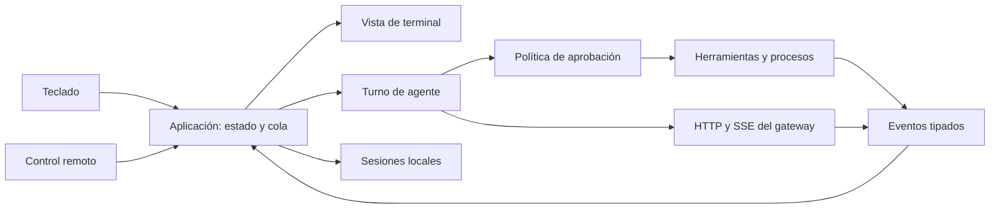

## Recomendación
- source: C:\Users\USUARIO\OneDrive\Documentos\ChatGPT\Lixbon\apps\cli\audit\EVALUACION_PYTHON_GO.md
- type: nfr
- content:

DATA_zlhvkyka_START
No fijar todavía el lenguaje de la implementación. Go modular sigue siendo una buena opción para una CLI independiente y un binario central sin Python/pip. Tras revisar cómo está construido el desktop, Rust merece un spike antes de iniciar el port: Tauri ya contiene Rust y el parser del agente se mantiene por separado en Python y JavaScript. Un core Rust consumido por la CLI y por Tauri podría reducir esa duplicación real. El beneficio de rendimiento en cualquiera de los dos lenguajes depende de corregir los algoritmos y medirlos.

No hay todavía implementación ni benchmark Go. No se puede atribuir una aceleración de la inferencia a esta migración: la CLI llama al gateway y Ollama ejecuta el modelo en los nodos GPU. La latencia completa incluye trabajo local, red, colas, procesamiento del contexto, generación y herramientas. Reducir el contexto innecesario puede disminuir trabajo del modelo, pero cambiar el lenguaje del cliente no cambia su GPU.

La decisión propuesta y las opciones se documentan en [ADR-001](ADR-001-CLI-GO.md).
DATA_zlhvkyka_END

## Stack concreto y duplicación entre CLI y desktop
- source: C:\Users\USUARIO\OneDrive\Documentos\ChatGPT\Lixbon\apps\cli\audit\EVALUACION_PYTHON_GO.md
- type: nfr
- content:

DATA_rzdtryx0_START
El desktop usa Tauri 2 con una biblioteca Rust (`apps/desktop/src-tauri/Cargo.toml`), pero el protocolo del agente está implementado en `apps/desktop/src/lib/agentProtocol.js` y se describe como espejo de `apps/cli/lixbon_cli/agent.py`. Si queremos evitar mantener ese parser tres veces después de sumar Go, una opción concreta es mover el núcleo puro a un crate Rust que consuman tanto el host Tauri como la CLI Ratatui. JS quedaría como presentación y puente de UI. Las herramientas del host y sus reglas de autorización seguirían siendo adaptadores separados cuando las capacidades difieran.

Stack a prototipar: `crates/lixbon-core` (Serde, JSON, parser/estado de agente, límites y contratos); CLI con Ratatui 0.30.2, Crossterm 0.29, Tokio, reqwest y RMCP oficial; desktop Tauri invocando el core por comandos/canales de streaming. La documentación de Ratatui muestra renderizado con diff de celdas y ofrece backend Crossterm; Tauri recomienda canales para streaming. El SDK MCP oficial existe tanto para Rust como para Go.

Go + Bubble Tea y el SDK MCP oficial continúa siendo alternativa razonable si el equipo prioriza Go. En ese caso, definir un JSON Schema y fixtures de protocolo que Python, JS y Go ejecuten; esto fija un solo contrato, aunque no comparte código. Evitar Go llamando un core Rust vía cgo: cgo solo expone la frontera C, exige ABI/manejo de memoria entre runtimes y complica los builds cross-platform con compilador nativo.

Recomendación actualizada: antes de escoger Go, hacer un spike Rust limitado al core compartido con Tauri, chat `--once` y TUI mínimo. Medir paridad y coste de integración en el desktop, además de build por sistema, cancelación y baseline local. Si adaptar Tauri al crate compartido no compensa la reducción de lógica duplicada, seguir con Go y corpus contractual común. Las versiones indicadas son las que documentan los proyectos al 05-10-2026; fijarlas tras compilar el prototipo.

Fuentes oficiales: [Ratatui 0.30.2](https://ratatui.rs/installation/), [Ratatui rendering](https://ratatui.rs/concepts/rendering/under-the-hood/), [Tauri streaming channels](https://tauri.app/develop/calling-frontend/), [RMCP Rust](https://github.com/modelcontextprotocol/rust-sdk), [Bubble Tea](https://github.com/charmbracelet/bubbletea), [MCP Go SDK](https://go.sdk.modelcontextprotocol.io/), [cgo](https://pkg.go.dev/cmd/cgo).
DATA_rzdtryx0_END

## Costos observados y prioridades
- source: C:\Users\USUARIO\OneDrive\Documentos\ChatGPT\Lixbon\apps\cli\audit\EVALUACION_PYTHON_GO.md
- type: nfr
- content:

DATA_ojkoymq4_START
Las referencias `archivo:línea` corresponden a la fuente Python del commit base.

| Prioridad | Evidencia en el código | Implicación | Cambio propuesto |
|---|---|---|---|
| Alta | `app.py:1398`, `1403`, `1413`, `1525`: cada evento reconstruye el prefijo completo y vuelve a limpiar la prosa; `Live` limita la frecuencia de pintado a 8 Hz, pero `_live_view()` se calcula por evento | Copias y análisis repetidos crecen con la respuesta; limitar FPS no elimina ese trabajo | Acumular deltas sin reconstruir toda la vista; filtro incremental de llamadas; generar vista solo cuando hay cambios y vence el intervalo; renderizar la cola visible y consolidar bloques terminados |
| Alta | `agent.py:667-689`: `read_file` lee el archivo completo antes de aplicar un rango | Pedir pocas líneas sigue pagando la lectura y las asignaciones de todo el archivo | Lectura incremental hasta el final del rango, límite de bytes y de longitud de línea; paginar resultados; extracción documental con límites propios |
| Alta | `agent.py:833`, `938-947`: búsqueda y shell capturan toda la salida antes del recorte; la búsqueda `rg` no define timeout | El límite mostrado de 300 líneas u 8.000 caracteres no limita la memoria ni el tiempo de captura | Drenar pipes continuamente a un buffer acotado o archivo temporal; timeout y cancelación; detener la búsqueda al alcanzar el presupuesto y comunicar truncamiento |
| Alta | `app.py:1492-1503`: una interrupción desde móvil o lector de teclado se comprueba al recibir el siguiente evento; `api.py:88` usa I/O bloqueante | Un stream silencioso puede demorar esas interrupciones. Ctrl+C como señal del hilo principal tiene otra ruta | Contexto de turno cancelable desde un canal independiente; cerrar request/body al cancelar; separar timeout de conexión, cabeceras e inactividad |
| Alta | `cli.py:26-46`, `documents.py:43-47`: instalación automática de paquetes; `ui.py:1183` depende de detalles internos del layout de prompt_toolkit | Arranque y comportamiento varían según entorno y versiones; mantenimiento frágil de terminal | Dependencias Go fijadas en `go.mod`/`go.sum`; una biblioteca propietaria del I/O de terminal; extracción PDF como decisión específica |
| Media | `app.py:450-482`: modelos, roles y plan se solicitan secuencialmente; `api.py:88` no administra un pool explícito | El arranque suma espera de varias operaciones de red | Mostrar estado local primero; validar cuenta y refrescar catálogo/roles con concurrencia acotada y caché; cliente HTTP/Transport compartido |
| Media | `agent.py:850-875`: el fallback materializa el recorrido completo antes de limitar a 5.000 archivos, y lee cada archivo completo | El recorrido y la memoria pueden superar ampliamente el límite de resultados | Recorrido que poda directorios antes de entrar y corta durante la iteración; lectura por líneas; mantener `rg` como acelerador opcional |
| Media | `agent.py:1533-1552`: el prompt del agente reconstruye el árbol en cada paso; `commands.py:151` ya tiene índice con TTL de 30 s | Se repite acceso al disco mientras dos mecanismos conocen el mismo workspace | Servicio de índice compartido, caché invalidada tras cambios; actualización externa gradual; límites explícitos de profundidad y resultados |
| Media | `remote.py:107-120`: `stop` no cierra directamente el stream lector ni espera sus hilos; `app.py:373` retorna en `--once` antes del `finally` de limpieza del loop | Recursos y procesos auxiliares tienen ciclos de vida diferentes según salida | Un cierre común desde el inicio de la aplicación; contextos, cierre de streams, espera limitada y limpieza de procesos/MCP |
| Media | `sessions.py:179-196`: índice compartido actualizado con read-modify-write y sin bloqueo entre procesos | Dos CLI simultáneas pueden sobrescribir entradas del índice; el reemplazo atómico de un archivo no evita esa carrera | Mantener JSON e índice reconstruible; bloqueo entre procesos para actualizar el índice, escritura atómica y pruebas de concurrencia; retención visible de 200 sesiones |
| Media | `mcp.py:18`, `159-183`: protocolo fijo y arranque secuencial por servidor | Clientes propios deben mantener negociación, límites y cierre; un servidor lento retrasa los siguientes | SDK MCP oficial, negociación comprobada, arranque acotado o diferido, tiempos y diagnósticos por servidor |
| Media | `cli.py:201` escribe la actualización sobre el archivo instalado; instaladores del gateway invocan Python | El mecanismo actual no sirve para reemplazar binarios por plataforma, especialmente en Windows | Publicación por OS/arquitectura, manifiesto y comprobación de integridad; descarga temporal, reemplazo recuperable y helper de actualización en Windows |
| Alta para migración | `.github/workflows/ci.yml:18` instala solo pytest; `test_log_layout.py:9` importa rich directamente | El entorno de CI declarado es insuficiente para ejecutar toda la suite desde cero; otros tests usan importorskip | Fijar e instalar dependencias de la línea base, ejecutar Windows/Linux y comprobar que los tests críticos no se omiten |

Se encontraron límites y defensas útiles que deben trasladarse: presupuesto de contexto, recorte de resultados, detección de bucles, aprobación distinta para shell y edición, resolución de rutas dentro del workspace, snapshots para `/undo`, JSON atómico por sesión y buffers de procesos en segundo plano. Migrar también exige conservar estos comportamientos.

### Aportes contrastados de una segunda revisión

`apps/desktop/src/lib/agentProtocol.js:3` declara ser un espejo del protocolo del CLI; `apps/desktop/src/lib/agent.js` implementa herramientas y comportamiento relacionados en JavaScript. Go no elimina esa duplicación. Antes de portar el parser conviene extraer un corpus JSON independiente del lenguaje que Python, JavaScript y Go consuman: llamadas válidas, JSON dañado, limpieza de prosa, límites de pasos y contexto. Las políticas de shell presentan diferencias entre productos y no deben unificarse por simple copia.

El desktop ya integra `keyring` en `apps/desktop/src-tauri/Cargo.toml:44` y `src/lib.rs:1174`. Es una referencia útil para una futura estrategia de credenciales de la CLI. El lenguaje Go no cambia por sí solo el almacenamiento actual de la API key en JSON: debe diseñarse la migración al almacén del sistema operativo y su comportamiento cuando este no esté disponible.

La actualización Python calcula SHA-256 del archivo anterior y del descargado (`cli.py:197-198`) para detectar cambios. No contrasta la descarga con un digest esperado autenticado ni verifica una firma de release. La nueva distribución necesita esas decisiones explícitas; compilar en Go no proporciona automáticamente una actualización segura ni un reemplazo viable en Windows.

La prueba de terminal propuesta en la etapa 1 debe ocurrir antes de comprometer el port completo del agente. El arranque más rápido, el tamaño/memoria menores, la compatibilidad de terminal y cualquier estimación de líneas o duración son hipótesis hasta medir o ejecutar casos representativos. Un ejecutable central sin Python tampoco elimina los programas que el usuario decida invocar como herramientas, servidores MCP o extractores documentales opcionales.

### Mediciones locales reproducibles

[benchmark_baseline.py](benchmark_baseline.py) ejecuta dos operaciones sintéticas del código actual, tres veces por tamaño, y guarda medianas. Resultados completos: [baseline-python.json](baseline-python.json).

```powershell
python apps/cli/audit/benchmark_baseline.py --output apps/cli/audit/baseline-python.json
```

| Operación | Tiempo de pared, mediana | Memoria o salida |
|---|---:|---|
| `join` + `clean_prose` por evento, 1.000 fragmentos de 64 caracteres | 55,993 ms | 63.999 caracteres finales |
| Misma operación, 2.000 fragmentos | 250,728 ms | 127.999 caracteres finales |
| Misma operación, 4.000 fragmentos | 984,869 ms | 255.999 caracteres finales |
| `read_file`, líneas 1-20 de un texto de 16 MiB | 79,428 ms | Pico de asignaciones Python: 34.390.686 bytes, aproximadamente 32,8 MiB; salida de 20.502 caracteres |

Duplicar 2.000 a 4.000 eventos multiplicó el tiempo por aproximadamente 3,9. Es compatible con el costo cuadrático de volver a procesar todos los prefijos. El replay excluye Markdown/Rich, dibujo de terminal y red: mide parte del trabajo de `_live_view`, no el turno completo. `tracemalloc` altera los tiempos y mide asignaciones Python, no RSS ni toda la memoria del proceso. Las lecturas usan caché del sistema. Tres repeticiones permiten una referencia inicial, no un p95 estable. No se han medido arranque, consumo en reposo, inferencia ni tamaño de un binario Go.
DATA_ojkoymq4_END

## Funciones y contratos que deben conservarse
- source: C:\Users\USUARIO\OneDrive\Documentos\ChatGPT\Lixbon\apps\cli\audit\EVALUACION_PYTHON_GO.md
- type: protocol
- content:

DATA_4rscou5a_START
| Área | Contrato actual | Criterio de migración |
|---|---|---|
| Entrada | Sin comando abre chat; `init`, `setup`, `status`, `models`, `usage`, `update`; aliases `run` y `start`; `chat --once` | Mismos comandos, flags, códigos de salida y conducta interactiva/no interactiva |
| Cuenta | Bearer API key, `User-Agent: Lixbon-CLI/<version>`; login con `issue_api_key=true`, `key_name="lixbon CLI"` | Mantener nombre exacto: afecta rotación y reglas del gateway (`core/gateway/routers/auth.py:58`) |
| Chat | `/v1/chat/completions`, `source="cli"`, `conversation_id`, `client_id`, título, `num_ctx`, `think`, `web_search`, `tools` | Fixtures de payloads completos, errores de cuota/autenticación y estados offline; no introducir reintentos automáticos de POST de chat |
| SSE | `lixbon_sources`, `reasoning_content`, content, tool_calls, usage y `[DONE]`; filtro de `<think>` partido entre fragmentos | Parser acotado; UTF-8 y eventos divididos; CRLF, keepalives, fin válido y error distinguibles; soportar el contrato actual y tolerar campos nuevos |
| Herramientas | 20 schemas; tool calls nativas y protocolo de texto tolerante; rescate del razonamiento; límites de 40 pasos y repetición | Corpus basado en casos existentes, orden de resultados e IDs; no ejecutar una llamada antes de completar y validar sus argumentos |
| Contexto | Ventana 16.384 por defecto, presupuesto del prompt 65 %, recorte y compactación; calibración por uso real | Mantener pares assistant/tool y petición original; calibración por modelo; mismo `num_ctx` enviado y presupuestado; evitar autoelevar VRAM por defecto |
| Workspace | Directorio de lanzamiento, `/workspace`, `LIXBON.md`, `.lixbon/commands/*.md` y `$ARGUMENTS` | Paridad de rutas, Unicode, espacios, symlinks y Windows; esquemas de aprobación y `/plan` |
| Estado local | `~/.lixbon/config.json`, history, `sessions/<uuid>.json`, `sessions/index.json` | Leer JSON existente y BOM UTF-8; conservar campos desconocidos; backup antes de evolución; formato compatible durante coexistencia |
| MCP | Config usuario y proyecto (`servers` o `mcpServers`), stdio, command/args/env/cwd; nombres `mcp__...` | Mantener precedencia y nombres; inicialización, cancelación, error, cierre y tools/list con paginación; efectos externos requieren su política existente |
| Remoto | Crear sesión; POST de lotes cada 250 ms; comandos por SSE; eventos hello/deltas/done/tools/snapshot/aprobaciones/bye | Mantener rutas y campos; cancelación independiente; cola acotada por bytes, prioridades y snapshot al recuperarse; no prometer exactamente una entrega sin soporte servidor |
| Archivos | Texto, PDF, Word, imágenes base64; límites actuales de tamaño y páginas; portapapeles por OS | Corpus documental y de imágenes; errores claros; conservar lectura local y no enviar documentos al backend silenciosamente |
| Funciones auxiliares | `/diff`, `/undo`, `/commit`, verificadores, procesos, búsquedas, Visuals y delegación | Mapear handlers de slash commands, catálogo y comportamiento; matriz explícita de funciones pendientes durante beta |
| Release | Gateway sirve `client_cli.py` y scripts Python; Docker incluye el artefacto | Nueva distribución binaria necesita trabajo de integración en el gateway, aunque la lógica del backend siga en Python |

`core/gateway/routers/attachments.py:66-69` ofrece extracción documental con `cookie_auth_required`; no es un reemplazo directo para la extracción local con API key de la CLI. Usarlo exigiría acordar autenticación, consentimiento para subir archivos y cambios de backend. Se propone resolver PDF localmente mediante un adaptador y comparar extractores sobre documentos reales antes de elegir una biblioteca o helper. DOCX puede usar ZIP/XML de Go, con pruebas de tablas y orden del contenido. OCR no forma parte de la paridad actual.
DATA_4rscou5a_END

## Arquitectura propuesta
- source: C:\Users\USUARIO\OneDrive\Documentos\ChatGPT\Lixbon\apps\cli\audit\EVALUACION_PYTHON_GO.md
- type: nfr
- content:

DATA_ca5lh8j5_START
Introducir el módulo Go en `apps/cli/go/` durante la transición. La fuente Python y su artefacto siguen siendo la referencia funcional hasta cumplir los criterios de sustitución.

```text
apps/cli/go/
  go.mod, go.sum
  cmd/lixbon/             entrada, flags, subcomandos
  internal/
    app/                  ciclo de vida, estado y cola de prompts
    domain/               mensajes, herramientas, eventos, errores tipados
    gateway/              HTTP, endpoints, SSE
    agent/                turnos, contexto, recuperación de llamadas
    policy/               aprobaciones y modo plan
    workspace/            rutas, índice, búsqueda, invalidación de caché
    tools/                archivos, edición, diffs, snapshots
    process/              shell, buffers, cancelación por plataforma
    terminal/             entrada, transcript, Markdown y tema
    sessions/             compatibilidad JSON, índice, bloqueo
    mcp/                  integración del SDK oficial
    remote/               transporte y eventos existentes
    documents/            adaptadores PDF/DOCX/imágenes/portapapeles
    update/               versiones, manifiesto y sustitución de binarios
```



Un dueño del estado de aplicación recibe eventos de UI, red, remoto y herramientas. El agente trabaja con un estado de turno explícito y publica resultados; los workers no modifican directamente los diccionarios compartidos ni escriben en la terminal. Un `context.Context` por aplicación y por turno propaga cancelación a requests, MCP y procesos.

Para evitar trasladar los costos actuales:

1. Separar recepción de SSE, estado de texto y dibujo. Acumular deltas con buffers y limitar el recálculo de la vista, además de limitar FPS. Un `strings.Builder.String()` por evento seguido de análisis completo seguiría repitiendo trabajo.
2. Compartir `http.Client` y `Transport`, cerrar cuerpos, distinguir timeouts, reutilizar conexiones y validar redirects sin reenviar credenciales a hosts distintos. La [documentación de net/http](https://pkg.go.dev/net/http) confirma reutilización y cancelación de requests mediante contexto.
3. Usar colas y buffers con presupuestos en bytes. Drenar la salida de los procesos incluso al truncar su presentación; no usar `CombinedOutput` para salidas sin límite.
4. Comenzar con ejecución ordenada de tools. Solo paralelizar lecturas cuya independencia se conoce y preservar el orden de resultados. Los nombres actuales de `READ_ONLY_TOOLS` incluyen operaciones de estado/procesos; no sirven por sí solos para decidir paralelismo. MCP no implica ausencia de efectos externos.
5. Usar `os/exec` con contexto y gestión de hijos por plataforma: grupos de procesos POSIX y Job Objects o mecanismo probado equivalente en Windows. [CommandContext](https://pkg.go.dev/os/exec#CommandContext) cancela el proceso directo; la limpieza de todo el árbol necesita implementación adicional.
6. Mantener JSON inicialmente. Añadir bloqueo entre procesos al índice compartido; serializar escrituras solo dentro de una CLI no resuelve varias instancias. Considerar otra persistencia si el perfil demuestra que JSON domina el costo.

### Dependencias propuestas

| Uso | Selección propuesta | Condición |
|---|---|---|
| Comandos, JSON, HTTP, procesos, ZIP/XML | Biblioteca estándar Go | Evitar dependencias que no aporten al caso; fijar toolchain soportado al iniciar el módulo |
| Terminal | [Bubble Tea v2](https://github.com/charmbracelet/bubbletea), Bubbles y Lip Gloss compatibles | Probar inline/scrollback, entrada en cola, resize, terminal angosta y Windows antes de adoptar; v2.0.10 observada en releases al revisar |
| Markdown | [Glamour](https://github.com/charmbracelet/glamour) | Renderizar bloques finalizados y cola acotada; medir respuestas largas |
| MCP | [SDK Go oficial](https://go.sdk.modelcontextprotocol.io/quick_start/) | Compatibilidad con los servidores stdio existentes, negociación de versión y límites |
| Búsqueda | `rg` opcional + fallback acotado | La CLI central funciona sin instalarlo; medir semántica de glob, ignores y regex |
| PDF | Extractor local por decidir | Calidad de extracción, licencia, tamaño y dependencia externa; no afirmar independencia de helpers hasta resolverlo |

La adopción de estas bibliotecas es propuesta, no un benchmark comparativo que demuestre que son la opción más rápida. La elección final y versiones exactas deben salir del primer prototipo y quedar fijadas. [Go diagnostics](https://go.dev/doc/diagnostics) aporta perfiles CPU/heap/bloqueo y tracing para medir ese prototipo.
DATA_ca5lh8j5_END

## Secuencia de migración y condiciones de salida
- source: C:\Users\USUARIO\OneDrive\Documentos\ChatGPT\Lixbon\apps\cli\audit\EVALUACION_PYTHON_GO.md
- type: nfr
- content:

DATA_0ynfokkt_START
| Etapa | Trabajo | Condición para avanzar |
|---|---|---|
| 0. Contratos y línea base | Fijar dependencias Python de validación; aclarar los dos fallos; fixtures SSE/errores/remoto/config/sesiones y casos de parsing; completar medidas de arranque/RSS | Base reproducible, errores conocidos documentados, cobertura de contratos críticos sin skips silenciosos |
| 1. Núcleo Go medible | Módulo y subcomandos locales; config compatible; login, HTTP/SSE, chat `--once`; prueba de terminal inline y extracción PDF | Gateway simulado equivalente; cancellation bajo stream silencioso; lectura 20 líneas y replay con límites; decisión de terminal/PDF sustentada |
| 2. Agente y workspace | 20 herramientas, política, snapshots/undo, procesos, índices, contexto, tool-calling nativo y fallback tolerante | Casos Python trasladados a Go; orden y efectos equivalentes; procesos hijos cerrados; pruebas de symlinks y rutas Windows/POSIX |
| 3. Interfaz y funciones conectadas | Sesiones/historial, todos los slash commands, adjuntos, MCP, remoto, portapapeles, Visuals/delegate | Matriz de paridad completa; terminal real Windows/Linux/macOS; remoto móvil y aprobaciones; varios procesos CLI simultáneos |
| 4. Distribución y sustitución | CI por OS/arquitectura, releases, manifiesto, instaladores y update; integración gateway de distribución | Instalación nueva y actualización desde Python, recuperación si descarga/reemplazo falla, prueba Windows de binario en ejecución, rollback al cliente anterior |

La etapa 4 requiere cambios coordinados de distribución en `core/gateway/routers/installer.py` y/o releases; se planifican después del núcleo CLI. Trabajar en `cli` sigue la instrucción del usuario. Cualquier integración a `master` y publicación debe ser una acción posterior específica.

### Cómo decidir si realmente optimizamos

Medir Python y Go con el mismo host, archivos, mensajes, velocidad de SSE y gateway simulado. Separar builds normales y builds con instrumentación; usar más repeticiones para p50/p95 y registrar toolchain, versiones, commit y CPU. Los resultados Go futuros se guardarán junto al JSON inicial, con fecha y commit propios.

| Métrica | Escenario | Criterio propuesto |
|---|---|---|
| Arranque | `--help`/`status` local, frío y caliente; primer prompt con red lenta | No bloquear la presentación local en peticiones auxiliares; menos tiempo medido que Python en cada OS objetivo |
| CPU de streaming | Replay de 1.000/2.000/4.000 eventos; bloques Markdown largos | El trabajo de ingestión/parseo incremental crece aproximadamente con los bytes nuevos; perfil de dibujo separado y presupuesto acotado |
| Memoria | Archivo 16 MiB, líneas 1-20; archivo 1 GiB; línea única enorme | Memoria gobernada por buffer y salida solicitada; límite explícito y error paginado, no lectura total |
| Cancelación | SSE silencioso, MCP bloqueado y shell con hijos | Objetivo local inicial: recuperar UI en menos de 250 ms; terminar hijos/recursos con límite de cierre explícito. Es una meta sin validar |
| Sesiones largas | Guardado/reanudación e índice con dos CLI | Sin pérdida de mensajes ni entradas; tiempo y memoria registrados; formato legado leído |
| Paridad | Agente/plan/ask/delegate, remoto, documentos y todas las tools | Casos funcionales aprobados y comprobaciones manuales de terminal/remoto; cualquier diferencia documentada antes de sustituir |
| Release | OS/arch, instalación limpia, update y fallback | Núcleo sin Python/pip; funciones con helper identificadas; integridad y rollback comprobados |

No se fija una promesa global de “x veces más rápido”. El primer entregable de implementación recomendable es la etapa 1: `status`, `models` y chat `--once` con SSE cancelable y formato local compatible, acompañado del prototipo de terminal. Su evidencia decide el ritmo de las etapas siguientes.
DATA_0ynfokkt_END

