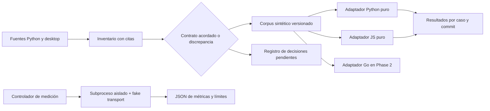

# Phase 1: Contratos y línea base reproducible — Research

**Researched:** 2026-10-05
**Domain:** contratos observables y medición offline de la CLI Python como referencia de Go.
**Confidence:** LOW para ejecución y soporte; fuentes locales leídas, sin pruebas ejecutadas.

<user_constraints>
## User Constraints (from CONTEXT.md)

## Decisions

- Go elegido por el usuario para entregar binarios sin Python/pip; véase `.planning/DECISION-CLI-GO.md`.
- Mantener Python como referencia y recuperación hasta aceptar paridad y distribución.
- Corpus portable independiente de implementaciones para payloads, SSE, tool calls, errores, limpieza y cancelación. Registrar diferencias entre Python y desktop, sin convertir comportamiento accidental en contrato silenciosamente.
- Preservar fuentes en `apps/cli/audit/`; los nuevos resultados vivirán en un directorio nuevo de migración o validación. El resultado histórico 131/2 no es un PASS de esta fase.
- Separar contratos de la API, comportamiento de terminal, política de permisos y recursos; la fixture de parsing no demuestra que la terminal real funcione.
- Orca coordina futuros worktrees y terminales. Cada plan debe tener dueño de archivos, dependencias y revisión independiente. Los worktrees del debate se conservan.
- Experimento Rust opcional y fuera del camino crítico; sin responsable/fecha desktop y criterios concretos queda diferido. No generar un plan obligatorio de Rust.
- No fijar biblioteca/versiones de UI/PDF basándose solo en lo nombrado por la evaluación. Phase 2 incluye pruebas acotadas antes del port completo.

## Open Choices to Resolve During Execution

- Matriz de OS/arquitectura/terminal y alcance de helpers por plataforma, basada en objetivos de distribución y evidencia disponible. La planificación no convierte destinos sin prueba en soportados.
- Política CGO y herramientas de extracción documental compatibles con la promesa de instalación.
- Presupuestos de arranque/RSS/streaming/cancelación a partir de mediciones reproducibles; no inventar umbrales universales ni mejoras de Go.
- Causa de los dos fallos de fixture y cómo reparar el entorno/referencia sin esconder fallos o modificar contratos para pasar pruebas.
- Discrepancia README frente a instalación de rich/prompt_toolkit/pypdf: inventariar y corregir documentación futura con evidencia.


## Deferred Ideas

Compartir implementación Rust con desktop, OCR y migración del backend quedan fuera del hito principal. Almacén de credenciales del OS es una mejora posterior separada de la elección del lenguaje.
</user_constraints>

## Summary

La fase debe entregar una referencia reproducible y un corpus independiente del lenguaje antes de implementar Go. La referencia histórica dice literalmente «131 aprobadas; 2 fallidas; 0 omitidas» y registra «Python 3.12.14, pytest 9.1.1, rich 15.0.0 y prompt_toolkit 3.0.53»; esto describe la auditoría, no una ejecución de esta investigación. [VERIFIED: apps/cli/audit/EVALUACION_PYTHON_GO.md:39-49]

El entorno actual devuelve Python 3.13.14, Node v24.19.0 y Go go1.26.5 windows/amd64; por tanto no reproduce automáticamente el intérprete histórico. [VERIFIED: consultas python --version, node --version y go version en esta sesión] La CI declara «python-version: '3.12'», «pip install pytest» y «python -m pytest apps/cli/tests -q». [VERIFIED: .github/workflows/ci.yml:14-19] No usar una suite parcialmente importable como evidencia de paridad.

**Primary recommendation:** planificar cuatro entregables: entorno y clasificación de fallos; inventario y corpus; matriz de aceptación; harness de comparación. Cada uno tendrá implementador, validador y revisor distintos, worktree aislado y evidencia ligada al commit. Recomendación de planificación derivada de las decisiones; no afirma ejecución.

## Architectural Responsibility Map

| Capacidad | Dueño primario | Secundario | Recomendación |
|---|---|---|---|
| Inventario de CLI y políticas | Adaptadores Python de validación | Revisión de fuentes | Extraer definiciones y rastrear handlers sin ejecutarlos |
| Corpus portable | Datos JSON neutrales | Adaptadores Python/JS y Go futuro | Mantener entrada y expectativa independientes del código |
| HTTP/SSE/cancelación | Fake transport y servidor loopback del harness | Cliente Python | Nunca usar gateway real ni credenciales |
| Medición | Proceso controlador externo | Subproceso bajo prueba | Separar reloj/RSS del código instrumentado |
| Matriz soportada | Gate humano y validación por destino | CI futura | Un destino objetivo no equivale a destino probado |

<phase_requirements>
## Phase Requirements

| ID | Alcance | Soporte de investigación |
|---|---|---|
| BASE-01 | Dependencias fijadas, casos críticos sin skips, clasificación de dos fallos históricos | Bootstrap explícito, preflight de imports, nodos concretos del fixture y reporte de suite |
| BASE-02 | Comandos, flags, códigos, slash commands, 20 schemas y corpus JSON portable | Mapa de fuentes, inventario con trazabilidad, adaptadores puros y pruebas de discrepancias |
| BASE-03 | OS/arch/terminal, CGO/nativos/helpers y reconciliación de dependencias | Gate de aceptación y dependencias separadas por función |
| BASE-04 | Comparación equivalente de arranque/RSS/streaming/lectura/cancelación | Conservar auditoría y generar nuevo harness con metadata y escenarios controlados |
</phase_requirements>

## Project Constraints (from AGENTS.md)

No se encontró AGENTS.md en la raíz; tampoco directorios de skills de proyecto .codex/skills o .agents/skills. [VERIFIED: Test-Path en esta sesión] El config declara «"commit_docs": false», «"nyquist_validation": true», «"security_enforcement": true», «"use_worktrees": true» y «"agent_skills": {}». [VERIFIED: .planning/config.json, leído completo en esta sesión] Esta asignación autoriza únicamente escribir este RESEARCH.md: no ejecutar pruebas, instalar, medir, cambiar implementación/auditoría/config ni hacer commit.

## Standard Stack

Usar la implementación Python actual, pytest y adaptadores de biblioteca estándar. No introducir Go ni seleccionar terminal/PDF en Phase 1. Esto es una recomendación de alcance, no una selección de nuevas versiones.

| Componente | Evidencia exacta | Acción prescrita |
|---|---|---|
| Entorno histórico | «Python 3.12.14, pytest 9.1.1, rich 15.0.0 y prompt_toolkit 3.0.53» [VERIFIED: apps/cli/audit/EVALUACION_PYTHON_GO.md:42] | Reproducir primero esa combinación o documentar indisponibilidad; fijar dependencias transitivas y hashes tras validación |
| Bootstrap interactivo | «REQUIRED_PACKAGES = ("prompt_toolkit", "rich", "pypdf")»; pip ejecutado por subprocess [VERIFIED: apps/cli/lixbon_cli/cli.py:26-47] | Preinstalar en entorno aislado; una importación faltante debe fallar el preflight, no instalar durante la prueba |
| Documentos | «pypdf = _ensure("pypdf", "pypdf")» y «docx = _ensure("docx", "python-docx")» [VERIFIED: apps/cli/lixbon_cli/documents.py:43-55,71-74] | Inventariar también python-docx; su versión histórica no está fijada por la evaluación |
| Desktop puro | «parte PURA del modo agente (sin Tauri ni DOM)» y «Espejo del protocolo del CLI» [VERIFIED: apps/desktop/src/lib/agentProtocol.js:1-3] | Consumir corpus mediante Node sin arrancar desktop |
| Artefacto Python | «OUTPUT = CLI_DIR / "client_cli.py"» y «OUTPUT.write_text(combined, encoding="utf-8", newline="\\n")» [VERIFIED: apps/cli/build.py:20-22,118-120] | Validar generate() contra artefacto; regenerar únicamente si un cambio autorizado de referencia lo requiere |

### Package Legitimacy Audit

No se recomienda instalar un paquete nuevo durante investigación. Las dependencias existentes son datos del código, no recomendaciones legitimadas por registry. El executor deberá verificar procedencia oficial y legitimidad antes del bootstrap fijado; esta investigación no consultó registries ni declaró versiones nuevas.

## Architecture Patterns



### Fuentes que el implementador debe abrir y citar

Estas son referencias de archivos inspeccionados, no rutas de nuevos artefactos prometidos.

| Fuente | Qué extraer | Evidencia / cautela |
|---|---|---|
| apps/cli/lixbon_cli/cli.py | Parser, defaults, aliases y códigos por handler | «for name in ("chat", "run", "start")»; «parser.parse_args(["chat"])» [VERIFIED: apps/cli/lixbon_cli/cli.py:308-326]. Abrir todo handler; no inferir códigos solo del parser |
| apps/cli/lixbon_cli/commands.py | Catálogo y parámetros de slash commands | Definiciones leídas 1-76; cruzarlas con dispatch real en app.py durante ejecución para detectar aliases/ocultos |
| apps/cli/lixbon_cli/agent.py | TOOL_SPECS, TOOL_SCHEMAS y executor | Nombres verbatim: «list_files», «find_files», «read_file», «outline», «search», «write_file», «edit_file», «multi_edit», «insert_at_line», «append_file», «mkdir», «delete_file», «rename_file», «run_command», «read_output», «stop_command», «fetch_url», «web_search», «todo», «ask_user». [VERIFIED: apps/cli/lixbon_cli/agent.py:82-103] Abrir schemas completos y executor antes de congelar argumentos |
| apps/cli/lixbon_cli/api.py | Headers, auth, payloads, errores y remoto | «"issue_api_key": True», «"key_name": "lixbon CLI"» [VERIFIED: apps/cli/lixbon_cli/api.py:103-111]. Capturar Request mediante fake; nunca login real |
| apps/cli/lixbon_cli/sse.py | Clasificación, filtro think y finalización | «"sources"», «"reasoning"», «"content"», «"tool_calls"», «"usage"», «"done"» [VERIFIED: apps/cli/lixbon_cli/sse.py:94-113] |
| apps/desktop/src/lib/agentProtocol.js | Parser y limpieza como consumidor distinto | Comparar resultados; conservar políticas por producto. La existencia de un espejo no implica paridad |
| apps/cli/lixbon_cli/config.py | Defaults, BOM y conservación de campos | «encoding="utf-8-sig"» y «cfg.update({k: v for k, v in stored.items() if v is not None})» [VERIFIED: apps/cli/lixbon_cli/config.py:47-55] |
| apps/cli/tests/test_agent_parsing.py | Casos iniciales del corpus | «test_python_style_quotes», «test_native_call_conversion», «test_tool_schemas_match_executor» [VERIFIED: apps/cli/tests/test_agent_parsing.py:23-35,74-85] |

### Estructura propuesta, todavía inexistente

[ASSUMED: propuesta de nombres, no estado del repositorio] Crear apps/cli/validation/ para requirements fijados, CONTRACTS.md, MATRIX.md, fixtures y controlador de medición. Crear apps/cli/tests/test_contract_corpus.py para consumidor Python y apps/cli/validation/verify_corpus.mjs para consumidor JS. El planner puede ajustar nombres, pero debe mantener auditoría histórica intacta y una sola copia del corpus. Ninguna de estas rutas se presenta como existente.

Cada fixture debe incluir identificador estable, origen con línea/commit, entrada sintética, resultado esperado y disposición: contrato aceptado, observación actual o discrepancia pendiente. Separar bytes de transporte de eventos semánticos; serializar bytes mediante base64 o hex para partir UTF-8 deliberadamente. Mantener orden de llamadas e IDs; no normalizar silenciosamente espacios o errores. La expectativa debe ser revisada independientemente de la función que se valida.

### Inventario contractual pendiente de extracción

El payload stream actual contiene verbatim «model», «messages», «conversation_id», «client_id», «title», «stream», «web_search», «source»; agrega «num_ctx» y «tools» si son truthy y «think» si no es None. [VERIFIED: apps/cli/lixbon_cli/api.py:215-238] Probar omisión frente a null/false/vacío, identidad CLI, headers y rutas con fake _open; no capturar tráfico personal.

El parser SSE decodifica cada línea con «errors="replace"», ignora JSON inválido y emite «yield ("done", None)» después de agotar el iterable. [VERIFIED: apps/cli/lixbon_cli/sse.py:70-87,112-113] Esto no demuestra distinción entre EOF truncado y DONE válido ni reconstrucción de bytes UTF-8 partidos. Registrar esos casos como brechas explícitas; no convertir el comportamiento accidental en obligación del Go futuro.

## Don't Hand-Roll

| Problema | Evitar | Usar |
|---|---|---|
| Oráculo de resultados | Reimplementar parser Python en fixture generator | Expectativas pequeñas revisadas, adaptadores independientes |
| Transporte offline | Gateway de producción y credenciales reales | Fake Request/response y servidor solo loopback con puerto asignado |
| Reconstrucción de artefacto | Ejecutar build que escriba para comprobar frescura | generate() y prueba de hash existente |
| RSS | Renombrar peak_python_bytes como RSS | Medidor externo por OS con método/unidad documentados |
| Entorno | Instalar paquetes por imports de la aplicación | Venv aislado, lock/hashes, preflight y wheelhouse provisionado antes de ejecución offline |

## Common Pitfalls

1. **Ocultar skips:** «pytest.importorskip("prompt_toolkit")» aparece en el fixture de caja; rich se importa directamente en layout. [VERIFIED: apps/cli/tests/test_input_box.py:12-18; apps/cli/tests/test_log_layout.py:9] El preflight debe fallar si faltan dependencias críticas y la validación revisar reporte de skips, no solo código cero.
2. **Clasificar prematuramente los fallos:** el callback guarda «measured["rows"]» y el fixture retorna «return measured["rows"]» después de prompt. [VERIFIED: apps/cli/tests/test_input_box.py:53-67] Instrumentar orden callback/entrada/salida en entorno aislado; distinguir fallo de fixture, dependencia y terminal. No xfail ni modificar expectativas para silenciarlo sin diagnóstico.
3. **Confundir métricas:** el harness declara «repetitions: 3» y límites «no medicion de RSS», «excluye Rich, terminal y red». [VERIFIED: apps/cli/audit/benchmark_baseline.py:65-78] No atribuir esos números a arranque, terminal o inferencia.
4. **Importar tarde el aislamiento:** «CONFIG_DIR = Path.home() / ".lixbon"» se calcula al importar y save_config crea ese directorio. [VERIFIED: apps/cli/lixbon_cli/config.py:19-21,59-61] Inyectar home temporal antes del import o patch de constantes antes de cualquier I/O; verificar ausencia de escrituras fuera del sandbox.
5. **Prometer soporte por README:** README dice «sin dependencias externas» y lista instaladores para Linux/macOS/Windows. [VERIFIED: apps/cli/README.md:5-14] Eso es documentación, no prueba de funcionamiento ni arquitectura soportada.

## Runtime State Inventory

Phase 1 no migra ni renombra estado real; inventaría contratos para migración posterior.

| Categoría | Hallazgo / límite | Acción de Phase 1 |
|---|---|---|
| Stored data | Config de usuario existe como contrato de código; contenido real no inspeccionado | Fixtures sintéticas BOM/campos desconocidos y sesiones; ningún acceso al home real |
| Live service config | No se contactó gateway ni servicios | Simular payloads y errores; estado live no verificado |
| OS-registered state | No se auditó registro, scheduler ni instalaciones globales | No modificar; inventariar prerequisitos declarados, gate futuro |
| Secrets/env vars | Código usa API key; no se leyeron secretos | Valores sintéticos y detección de fuga en resultados |
| Build artifacts | Generación de artefacto explícita en build.py | Comparación sin escritura; conservar artefacto hasta reparación autorizada |

## Code Examples

Comandos futuros, **no ejecutados aquí**. La suite existente verifica frescura mediante «build.generate()» y compara SHA-256 normalizando CRLF. [VERIFIED: apps/cli/tests/test_build_fresh.py:22-30]

```powershell
python -m pytest apps/cli/tests/test_build_fresh.py -q -p no:cacheprovider
python -m pytest apps/cli/tests/test_input_box.py::test_caja_en_reposo_mide_tres_filas apps/cli/tests/test_input_box.py::test_complete_while_typing_dispararia_el_alto -vv -rA -p no:cacheprovider
python -m pytest apps/cli/tests -q -rA -p no:cacheprovider
```

Ejecutar estos comandos solo con intérprete del venv fijado, plugins externos desactivados, temp propio y red bloqueada. En PowerShell guardar/restaurar variables del proceso; no repurposing HOME. Para el harness nuevo, inyectar rutas temporales de configuración/sesión/diagnóstico y sustituir APIs antes de importar app. Los nombres de los dos nodos son evidencia histórica y definiciones actuales, no resultado actual.

## State of the Art

No se evalúan nuevas bibliotecas ni versiones. Go está elegido y terminal/PDF se decidirán mediante pruebas de Phase 2. [VERIFIED: .planning/DECISION-CLI-GO.md:23-34] La aportación de Phase 1 es contrato común mediante datos y medición comparable, no compartir implementación entre runtimes.

## Environment Availability

| Dependencia | Disponible en sesión | Límite |
|---|---|---|
| Python | 3.13.14 | Diferente del 3.12.14 histórico; paquetes del entorno no inspeccionados |
| Node | v24.19.0 | Puede servir consumidor JS; no ejecutado |
| Go | go1.26.5 windows/amd64 | No se necesita módulo/build en esta fase |
| Windows host | Observado por entorno | Otros OS/terminales no validados |
| Wheelhouse / entorno histórico | No verificado | Provisionar y fijar en ejecución antes de exigir offline |

[VERIFIED: consultas de versiones de esta sesión; apps/cli/audit/EVALUACION_PYTHON_GO.md:42] Ausencia de prueba de Linux/macOS/arquitecturas debe aparecer como pendiente, nunca soporte aceptado.

## Validation Architecture

### Test Framework

| Property | Value |
|---|---|
| Framework | pytest existente; versión histórica «pytest 9.1.1», actual instalada no comprobada |
| Config file | No se identificó configuración pytest en el listado de apps/cli; establecer entorno/plugins explícitos |
| Quick run command | python -m pytest apps/cli/tests/test_agent_parsing.py apps/cli/tests/test_build_fresh.py -q -rA -p no:cacheprovider |
| Full suite command | python -m pytest apps/cli/tests -q -rA -p no:cacheprovider |
| Evidencia | Guardar stdout/stderr, returncode, JUnit XML, collected/pass/fail/skip, versión y commit; no afirmar duración <30s sin medir |

[VERIFIED: .github/workflows/ci.yml:18-19; apps/cli/tests/test_agent_parsing.py y test_build_fresh.py abiertos; evaluación:42] Comandos son instrucciones futuras, no PASS.

### Phase Requirements → Test Map

| Req | Comportamiento | Tipo | Comando futuro | Existencia |
|---|---|---|---|---|
| BASE-01 | Clasificar fallos y frescura | Unit/integration offline | Comandos existentes anteriores y preflight de imports del entorno | Tests existentes; lock y preflight Wave 0 |
| BASE-02 | Corpus completo, portable, expectativas válidas y diferencias explícitas | Contrato | python -m pytest apps/cli/tests/test_contract_corpus.py -q; node apps/cli/validation/verify_corpus.mjs | Propuestos, Wave 0 |
| BASE-03 | Matriz y dependencia por función concordantes con fuente | Revisión automatizada de inventario + gate humano | python -m pytest apps/cli/tests/test_contract_corpus.py -q -k inventory | Propuesto; OS/arch/CGO exige aceptación humana |
| BASE-04 | Escenarios reproducibles y metadata; medición RSS distinta de allocations | Integration/smoke de harness | python -m pytest apps/cli/tests/test_contract_corpus.py -q -k baseline | Propuesto; benchmarks completos fuera de quick run |

[ASSUMED: nombres nuevos y selectors propuestos] El validador deberá comprobar que los selectors colectan casos; cero casos no constituye PASS. No usar un test que solo compare fixture con otra copia de la fixture: invocar implementación real con límites de I/O simulados y verificar capturas, cierre y orden.

### Wave 0 Gaps

- Entorno reproducible: lock de Python/transitivas, versiones/hashes reales y preflight sin auto-install.
- Corpus y adaptadores Python/JS, esquema de fixture, validator de IDs/origen/expectativa y manifest de casos críticos.
- Mock HTTP/SSE: error HTTP, offline, chunking, EOF, keepalive, cierre y stream silencioso controlado; el test debe tener timeout y no dejar hilos.
- Harness ampliado y prueba de sus metadata/aislamiento. Captura de RSS externa por destino; startup help/status, replay, lectura parcial y cancelación.
- Gate humano de OS/arquitectura/terminal, CGO/nativos/helpers y criterios cuantitativos, después de evidencia disponible.
- Documentación de los dos fallos: reproducción, causa, disposición y reparación mínima separada de cambios de contrato.

### Sampling Rate

Por task: quick run del ámbito y manifest de casos críticos sin skips. Por wave: suite Python completa y corpus JS; revisión independiente del diff y de evidencia. Phase gate: todos BASE aceptados o pendientes explícitos que impiden llamar completa a la fase; benchmark no sustituye terminal física ni evidencia de destino.

### Diseño de BASE-04

Prescribir mediciones nuevas bajo directorio de validación, conservando audit. Registrar commit y dirty state, hash de fuente/artefacto, Python y dependencias, OS/CPU/arch, terminal, warm/cold declarado, reloj, instrumentación, fixture hash/tamaño, repeticiones y muestras individuales. Definir cold con protocolo específico; no afirmar cache fría sin control.

El harness histórico crea «scratch = Path(tempfile.mkdtemp(prefix="lixbon-cli-audit-")).resolve()», escribe «(b"x" * 1023 + b"\\n") * 16384» y usa «tool_read_file(scratch, "large.txt", 1, 20)». [VERIFIED: apps/cli/audit/benchmark_baseline.py:81-91] Reutilizar esos datos/escenarios como referencia, extendiendo en un harness nuevo. Arranque con help y status aislado; streaming con mismo corpus/ritmo; lectura parcial con misma fixture; cancelación con response fake bloqueada y reloj hasta cierre/retorno. No usar models real. Medir RSS y asignaciones separadamente, instrumentación on/off separada, y distribución de muestras sin derivar p95 fiable de tres observaciones. Acordar presupuestos después de medir Python; no fijar «250 ms» como contrato desde una propuesta del audit.

## Security Domain

Config habilita seguridad; esta fase no valida un servicio desplegado. [VERIFIED: .planning/config.json, «"security_enforcement": true»] Aplicar controles del harness: credenciales sintéticas, loopback, red externa bloqueada, temp dedicado, fuentes leídas como datos, no shell del corpus y salida sanitizada. Recomendaciones de diseño, no certificación ASVS.

| Área ASVS conceptual | Aplica a Phase 1 | Control prescrito |
|---|---|---|
| Autenticación | Fixture de payload/header | No credenciales reales; comprobar identidad y auth=False en login |
| Sesión | Fixtures de estado | Home temporal, no historial personal |
| Acceso | Aislamiento del harness | Restricción de filesystem y transporte |
| Validación | Corpus y entrada SSE | Esquema de datos, límites y rechazo de payload incompleto antes de efectos |
| Criptografía | Hash de evidencia | Usar biblioteca estándar; no diseñar firma/update en Phase 1 |

La numeración/version ASVS no se verificó externamente en esta investigación; el plan de seguridad debe fijarla antes de atribuir conformidad. [ASSUMED: mapa conceptual, no checklist normativo verificado]

## Assumptions Log

| # | Claim | Riesgo |
|---|---|---|
| A1 | Rutas nuevas apps/cli/validation y test_contract_corpus propuestas | Planner debe crearlas y registrar ubicación real |
| A2 | Selectors inventory/baseline propuestos | Cero colección puede aparentar validación |
| A3 | Mapa ASVS conceptual sin edición/version verificada | No reclamar cumplimiento normativo |
| A4 | Soporte, CGO/helpers y budgets todavía por acordar | Promesa de distribución o rendimiento incorrecta |

## Open Questions

1. ¿Qué OS/arch/terminales son obligatorios y quién aporta validación real? Gate de aceptación al final de Phase 1; mantener objetivos y soporte demostrado en columnas distintas.
2. ¿Puede reconstruirse exactamente Python 3.12.14 y la versión histórica de pypdf/python-docx? Registrar falta de versión histórica; no inventarla.
3. ¿Por qué pre_run no llena rows? No resuelto por lectura. Reproducción e instrumentación autorizadas en ejecución, con comparación de entorno.
4. ¿Qué divergencias Python/desktop se aceptan como contrato común? Evaluar caso por caso; permisos de shell pueden seguir distintos.
5. ¿Qué método de RSS y presupuesto por destino? Acordar después de medir; CGO y helper PDF quedan gate de instalación y selección de Phase 2.

## Sources

Fuentes primarias leídas: CONTEXT, REQUIREMENTS, STATE, DECISION-CLI-GO, EVALUACION_PYTHON_GO; código Python cli/api/sse/config/documents/commands/agent; build y benchmark histórico; tests parsing/context/input_box/log_layout/build_fresh; agentProtocol.js y package.json desktop; CI y config GSD. Los tags con líneas identifican definiciones/observaciones, no ejecución.

No hubo fuentes web ni selección de versiones nuevas. No se construyó research-plan ni caché: requeriría escribir otros archivos y la asignación limita escritura a RESEARCH.md. Se consultó classify-confidence: provider codebase --verified devolvió LOW; se mantiene LOW global para no convertir inspección en prueba de runtime. [VERIFIED: salida seam en sesión]

## Metadata

**Confidence breakdown:** fuentes locales trazables; ejecución, soporte y rendimiento sin validar (LOW).
**Research date:** 2026-10-05.
**Valid until:** hasta que cambien commit, dependencia o contrato; reabrir fuentes al ejecutar.
**Limitaciones:** ningún test/benchmark, instalación, gateway, cambio de código/audit/config ni commit realizado.

